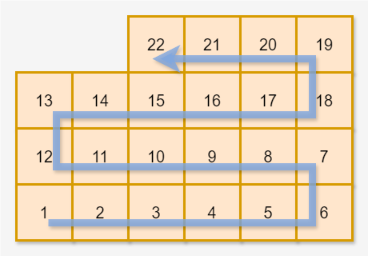
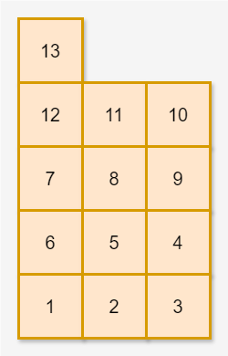

# [택배 상자 꺼내기](https://school.programmers.co.kr/learn/courses/30/lessons/389478)

## 문제 설명

1 ~ `n`의 번호가 있는 택배 상자가 창고에 있습니다. 당신은 택배 상자들을 다음과 같이 정리했습니다.  
왼쪽에서 오른쪽으로 가면서 1번 상자부터 번호 순서대로 택배 상자를 한 개씩 놓습니다. 가로로 택배 상자를 `w`개 놓았다면 이번에는 오른쪽에서 왼쪽으로 가면서 그 위층에 택배 상자를 한 개씩 놓습니다. 그 층에 상자를 `w`개 놓아 가장 왼쪽으로 돌아왔다면 또다시 왼쪽에서 오른쪽으로 가면서 그 위층에 상자를 놓습니다. 이러한 방식으로 `n`개의 택배 상자를 모두 놓을 때까지 한 층에 `w`개씩 상자를 쌓습니다.  

- 위 그림은 `w` = 6일 때 택배 상자 22개를 쌓은 예시입니다.

다음 날 손님은 자신의 택배를 찾으러 창고에 왔습니다. 당신은 손님이 자신의 택배 상자 번호를 말하면 해당 택배 상자를 꺼내줍니다. 택배 상자 A를 꺼내려면 먼저 A 위에 있는 다른 모든 상자를 꺼내야 A를 꺼낼 수 있습니다. 예를 들어, 위 그림에서 8번 상자를 꺼내려면 먼저 20번, 17번 상자를 꺼내야 합니다.  
당신은 꺼내려는 상자 번호가 주어졌을 때, 꺼내려는 상자를 포함해 총 몇 개의 택배 상자를 꺼내야 하는지 알고 싶습니다.  
창고에 있는 택배 상자의 개수를 나타내는 정수 `n`, 가로로 놓는 상자의 개수를 나타내는 정수 `w`와 꺼내려는 택배 상자의 번호를 나타내는 정수 `num`이 매개변수로 주어집니다. 이때, 꺼내야 하는 상자의 총개수를 return 하도록 solution 함수를 완성해 주세요.  

---

## 제한사항

- 2 ≤ `n` ≤ 100
- 1 ≤ `w` ≤ 10
- 1 ≤ `num` ≤ `n`

---

## 테스트 케이스 구성 안내

아래는 테스트 케이스 구성을 나타냅니다. 각 그룹 내의 테스트 케이스를 모두 통과하면 해당 그룹에 할당된 점수를 획득할 수 있습니다.

| 그룹 | 총점 | 추가 제한 사항      |
| ---- | ---- | ------------------- |
| #1   | 10%  | w = 1               |
| #2   | 20%  | n은 w의 배수입니다. |
| #3   | 70%  | 추가 제한 사항 없음 |

---

## 입출력 예

| n   | w   | num | result |
| --- | --- | --- | ------ |
| 22  | 6   | 8   | 3      |
| 13  | 3   | 6   | 4      |

---

### 입출력 예 설명

#### 입출력 예 #1

문제 예시와 같습니다. 꺼내야 하는 상자의 총개수는 8번 상자를 포함해 3개입니다.

#### 입출력 예 #2

6번 상자를 꺼내려면 먼저 13, 12, 7번 상자를 꺼내야 합니다. 
따라서 4를 return 합니다.
